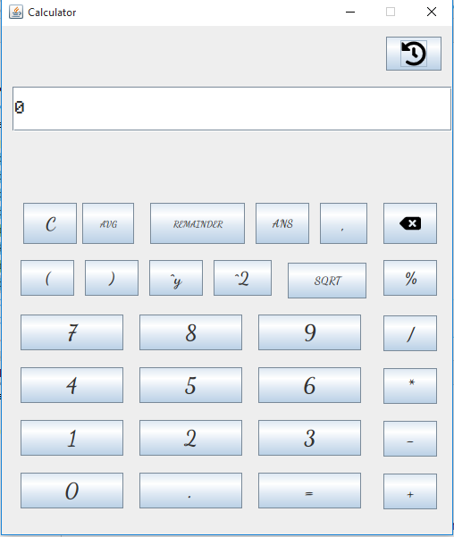
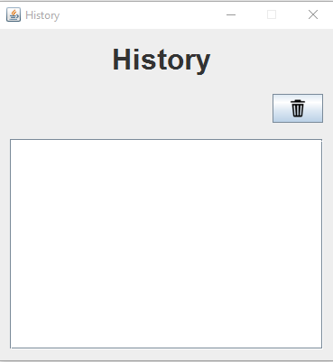

**Simple Calculator in Java Swing**

This is simple calcualtor created using java swing.
This calculator app has a nice gui and history support.
The calculator can perform the following basic operations:
- Addition
- Substraction
- Multiplication
- Division
- Percentage
- Average
- Remainder
- Square
- Power
- Square Root

This claculator also provides a special keyword `ANS` which
gives you the last result. It's useful when you want to perform
any calculation using the value from the last calculation.

History fuctionality not only stores the calculation with expression
and results at runtime but also persists it in a file. You will get
back all you previous calculations with results if you don't clear
the history.

**Screen Shot**

Main calculator window



History window



For a working demo of this calculator app please check the
<a href="https://drive.google.com/file/d/1zaIKjJhvi8fCbdEzciRXyIZF00Sgh-hS/view?usp=sharing">link</a>

<b><i>Note:</i></b> You are free to use and update this project but not merge your code into this branch

```
  Copyright 2021 rahulstech
 
  Licensed under the Apache License, Version 2.0 (the "License");
  you may not use this file except in compliance with the License.
  You may obtain a copy of the License at
 
      http://www.apache.org/licenses/LICENSE-2.0
 
  Unless required by applicable law or agreed to in writing, software
  distributed under the License is distributed on an "AS IS" BASIS,
  WITHOUT WARRANTIES OR CONDITIONS OF ANY KIND, either express or implied.
  See the License for the specific language governing permissions and
  limitations under the License.
```